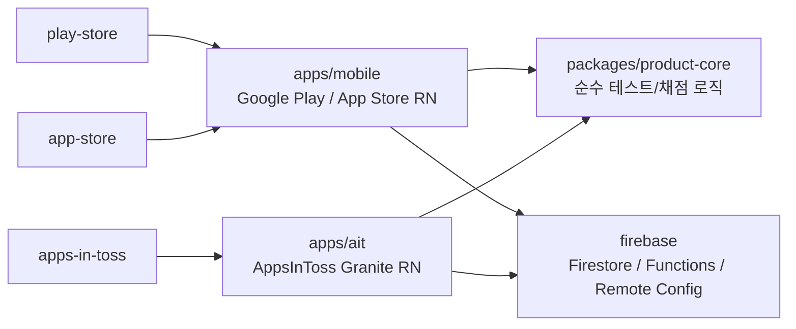

# Trait Test Hub

여러 성향 테스트를 제공하고 결과/익명 분포/공유 흐름을 공통화하는 React Native + Firebase 기반 앱입니다.

기획 source는 Obsidian의 `프로젝트/앱 제작 공장/기획 인박스/trait-test-hub 최초 기획서.md`입니다. 이 repo는 Apple App Store, Google Play Store, AppsInToss 동시 출시를 목표로 잡는 실행 골격입니다.

## 구조



## 기본 명령

```bash
pnpm dev:preview
pnpm check:preview
pnpm check:core
pnpm check:release
pnpm check:release:strict
pnpm check:mobile
pnpm check:ait
```

현재 `apps/mobile`과 `apps/ait`는 등록값 확정 전 placeholder입니다. 실제 RN/Granite scaffold 이후 `build:android`, `build:ios`, `build:ait`를 release gate로 올립니다.

## 로컬 preview

등록값 확정 전에도 제품 흐름을 볼 수 있도록 브라우저 preview를 제공합니다.

```bash
pnpm dev:preview
```

기본 URL은 `http://127.0.0.1:4173/`입니다. 이 preview는 `packages/product-core`의 샘플 테스트와 채점 로직을 그대로 사용합니다.

Android Emulator Chrome에서 볼 때는 host alias를 써야 합니다.

```bash
HOST=0.0.0.0 PORT=4174 pnpm dev:preview
adb shell am start -a android.intent.action.VIEW -d http://10.0.2.2:4174/apps/preview/index.html com.android.chrome
```

## 테스트팩

테스트 콘텐츠는 manifest + 정적 JSON payload 구조로 관리합니다.

```bash
pnpm generate:test-packs
pnpm compile:test-packs
pnpm sync:test-packs
pnpm validate:test-packs
pnpm check:content
```

자동 생성 테스트 PR은 테스트별 draft, entry, payload만 추가합니다. 결과 화면은 앱의 로컬 색상·이모지 카드로 표현하며 테스트팩 이미지는 사용하지 않습니다. manifest, pack index, public 산출물은 check/build 단계에서 컴파일됩니다.

자세한 구조는 [docs/test-packs.md](docs/test-packs.md)를 봅니다.
자동 생성 테스트를 PR로 보내는 체계는 [docs/content-automation.md](docs/content-automation.md)를 봅니다.

## 공개 preview

GitHub Pages custom domain으로 공개 preview를 제공합니다.

```text
https://traithub.vzyx.xyz
```

Pages 산출물은 아래 명령으로 생성합니다.

```bash
pnpm build:pages
```

기여자는 [CONTRIBUTING.md](CONTRIBUTING.md)를 참고해 테스트팩 draft를 제안할 수 있습니다.

## 출시 타깃

| 타깃 | repo 위치 | 산출물 | 현재 상태 |
| --- | --- | --- | --- |
| Google Play Store | `apps/mobile`, `play-store/` | signed `.aab` | package name: `com.seorilabs.traithub` |
| Apple App Store | `apps/mobile`, `app-store/` | archive/export, TestFlight | bundle ID 확정 필요 |
| AppsInToss | `apps/ait`, `apps-in-toss/` | `.ait` | appName/등록 이미지 확정 필요 |

## 확정 필요

- iOS bundle ID
- AppsInToss `appName`
- Firebase project ID와 앱 등록값
- 일반 사용자 Firebase Auth 사용 여부
- LLM provider, 비용 한도, 승인자 정책
- 마켓 privacy/data safety/IARC/GRAC 답변
