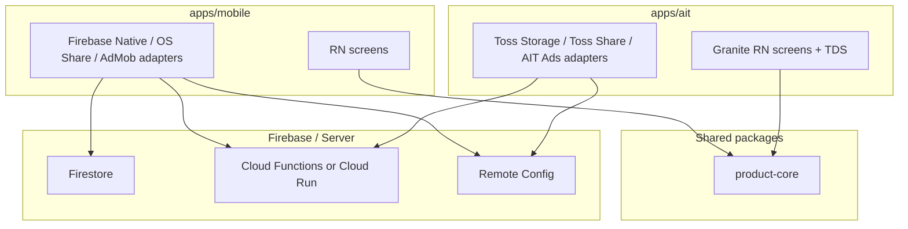

# 아키텍처

## 원칙

- `packages/product-core`는 테스트 콘텐츠 모델, 검증, 채점, 결과 선택만 담당한다.
- `product-core`는 React Native, Firebase, AppsInToss, Google/Apple SDK를 import하지 않는다.
- `apps/mobile`은 Google Play/App Store용 native React Native shell이다.
- `apps/ait`는 AppsInToss Granite React Native shell이다.
- Firebase, 광고, 공유, analytics, remote config는 app target adapter 뒤에 둔다.

## 런타임 경계

## 초기 contract 후보

| Contract | 책임 | mobile adapter | AIT adapter |
| --- | --- | --- | --- |
| `TestCatalogRepository` | published 테스트 목록/상세 조회 | Firestore + cache | Functions/API + cache |
| `StatsRepository` | 결과 분포/완료 수 조회 | Functions | Functions |
| `AnalyticsClient` | funnel event | Firebase Analytics | AppsInToss 또는 noop |
| `ShareClient` | 결과 공유 | OS share/deep link | AppsInToss share |
| `AdProvider` | 결과 화면 광고 | AdMob 후보 | AppsInToss 광고 후보 |
| `RemoteConfigRepository` | 오늘의 테스트/feature flag | Firebase Remote Config | Functions/API 후보 |
