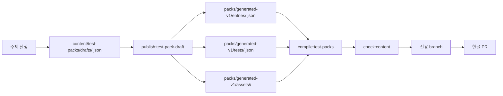

# 성향 테스트 자동 생성 체계

자동화의 목표는 한 번 실행될 때마다 완성된 성향 테스트 1개를 draft로 만들고, 검증을 통과한 변경만 PR로 보내는 것입니다. 자동화 자체를 만들기 전에 파일 계약과 gate를 고정합니다.

자동화 세션에 그대로 붙여넣는 실행용 프롬프트는 [docs/prompts/new-test-pack-pr.md](prompts/new-test-pack-pr.md)에 있습니다.

## 흐름



## 자동화 1회 산출물

자동화는 한 번 실행될 때 아래 범위만 변경해야 합니다. 이 범위는 테스트별 독립 경로라서 여러 자동화 PR이 동시에 열려도 같은 파일을 수정하지 않습니다.

- `content/test-packs/drafts/<testId>.json`: 생성 초안
- `content/test-packs/packs/generated-v1/tests/<testId>.json`: source payload
- `content/test-packs/packs/generated-v1/entries/<testId>.json`: manifest entry metadata
- `content/test-packs/packs/generated-v1/assets/<testId>/`: 결과 이미지 원본

자동 생성 테스트 PR은 아래 공유 산출물을 수정하면 안 됩니다.

- `content/test-packs/manifest.json`
- `content/test-packs/packs/<packId>/pack.json`
- `public/test-packs/**`

공유 manifest, pack index, public 산출물은 `compile:test-packs`, `check:content`, `build:pages`가 필요할 때 재생성합니다.

기존 공개 테스트의 `testId` 의미를 바꾸면 안 됩니다. 기존 테스트 수정이 필요하면 새 `version` 정책을 별도로 세운 뒤 진행합니다.

## Draft 파일 계약

자동화는 아래 형식의 draft JSON을 먼저 만들어야 합니다.

```json
{
  "schemaVersion": 1,
  "packId": "generated-v1",
  "metadata": {
    "summaryKo": "짧은 목록용 설명",
    "tags": ["routine", "daily"],
    "categoryLabelKo": "일상",
    "tagLabelsKo": {
      "routine": "루틴",
      "daily": "일상"
    },
    "estimatedMinutes": "3-5분"
  },
  "test": {
    "id": "example-test",
    "version": 1,
    "status": "published",
    "titleKo": "예시 성향 테스트",
    "category": "routine",
    "axes": [],
    "questions": [],
    "results": []
  }
}
```

새 category나 tag를 추가하면 `categoryLabelKo`, `tagLabelsKo`를 반드시 같이 넣습니다. label 없이 ID만 추가하면 앱 필터 UI가 품질 낮은 상태로 노출됩니다.

`publish:test-pack-draft`는 draft metadata를 `entries/<testId>.json`으로 옮겨 저장합니다. category/tag label도 entry에 보관되므로 새 테스트 PR마다 global manifest를 직접 수정하지 않습니다.

## 품질 기준

`pnpm check:content`가 통과해야 PR 후보가 됩니다.

- manifest와 payload의 `testId`, `version`, `packId`, stats key가 일치한다.
- 자동 생성 테스트는 최소 10문항이어야 한다.
- 자동 생성 테스트는 최소 4개 결과를 가져야 한다.
- 자동 생성 테스트의 각 문항은 최소 3개 선택지를 가져야 한다.
- 질문 ID, 결과 code, axis ID가 중복되지 않는다.
- 모든 option score는 존재하는 axis만 참조하고 숫자여야 한다.
- 일반 vector scoring 테스트는 모든 결과 vector가 모든 axis 값을 가진다.
- `axis-letter-majority` 테스트는 axis별 2개 letter, tie breaker, 모든 결과 조합을 갖춘다.
- 가능한 답변 조합을 점검할 수 있는 규모라면 모든 결과가 최소 1회 이상 도달 가능해야 한다.
- 자동 생성 테스트의 결과는 DPTI 수준의 상세 필드를 가져야 한다.
  - `summaryKo`: 목록/결과 상단용 요약
  - `descriptionKo`: 결과 본문 설명
  - `strengthsKo`: 3개 이상
  - `watchoutsKo`: 2개 이상
  - `collaborationKo`: 관계/업무/일상 적용 조언
  - `shareIntroKo`: 공유 카드 문구
  - `imagePath`: 결과 대표 이미지
  - `shareImagePath`: 공유용 이미지
- 자동 생성 결과 이미지는 PNG/JPG/WebP 파일이어야 하며 `/test-packs/packs/generated-v1/assets/<testId>/` 아래에 있어야 한다.
- `TODO`, `placeholder`, `임시`, `lorem` 같은 placeholder 문구가 없어야 한다.

## 이미지 저장소 정책

초기 자동화는 결과 이미지를 repo에 포함하고 GitHub Pages로 서빙합니다.

```text
content/test-packs/packs/generated-v1/assets/<testId>/<resultCode>.png
runtime path: /test-packs/packs/generated-v1/assets/<testId>/<resultCode>.png
```

이 방식을 기본값으로 두는 이유는 PR에서 이미지와 문구를 함께 리뷰할 수 있고, `pnpm check:content`가 컴파일된 임시 산출물에서 파일 존재 여부를 검증할 수 있기 때문입니다.

Firebase Storage는 사용자가 업로드하는 이미지, 운영자가 콘솔에서 교체하는 이미지, repo에 넣기 어려운 대량 이미지가 필요해질 때 전환합니다. 이때도 공개 읽기 범위, Storage Rules, App Check, 비용 알림을 먼저 확정해야 합니다.

vzyx 정적 호스팅은 내부 QA나 임시 대량 파일 테스트에는 쓸 수 있지만, 공개 자동화의 기본 이미지 저장소로 쓰지 않습니다. GitHub Pages 배포와 별도 운영 경로가 생기면 PR 검증과 실제 노출 파일이 갈라지기 때문입니다.

## 금지/주의 주제

자동 생성 테스트는 가벼운 자기이해/취향/일상/업무 성향에 한정합니다.

- 의학적 진단, 정신건강 진단, 법률/금융 판단, 정치 성향 판정은 제외합니다.
- MBTI, DISC, Big Five처럼 기존 체계의 이름과 유형 구조를 그대로 차용하지 않습니다.
- 특정 실존 인물, 브랜드, 저작권 캐릭터, 민감 집단을 유형화하지 않습니다.
- 돈 절약, 투자, 대출, 보험 최적화처럼 사용자 손실을 유발할 수 있는 주제는 제외합니다.

## PR 규칙

- branch: `feature/generated-test-<testId>`
- commit: 한글 bullet 형식
- PR 제목: `성향 테스트 추가: <테스트명>`
- PR 본문에는 아래를 포함합니다.
  - 생성한 테스트 ID와 제목
  - 질문 수, 결과 수, category/tag
  - 실행한 검증 명령과 결과
  - 사람이 확인해야 할 문항/결과 톤 이슈

자동화 PR은 release blocker 해결 PR과 섞지 않습니다. 또한 공유 manifest, pack index, public 산출물 변경을 포함하지 않습니다.
