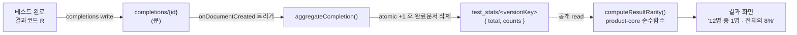

# 결과 통계 ("N명 중 1명")

결과 화면에서 "나와 같은 성향"의 희소성을 보여주는 기능입니다. 완료 수를 결과 code별로 집계하고, 사용자가 받은 결과의 비율을 화면에 표시합니다.

## 흐름



핵심: **org 정책이 public 함수 호출(allUsers run.invoker)을 막아** onCall 함수를 클라이언트가 직접 부를 수 없습니다. 그래서 클라이언트는 firestore에 **직접** 접근합니다.

- **완료 기록**: `completions`에 1건 write → firestore 트리거 `aggregateCompletion`이 `test_stats`로 집계(트리거는 호출이 아닌 이벤트라 org 정책과 무관). 처리한 완료 문서는 삭제(큐).
- **분포 조회**: `test_stats`가 공개 read라 클라이언트가 직접 읽음.
- **접근 수단**: firestore REST API(`firestore.googleapis.com/v1/...?key=<apiKey>`)를 `fetch`로 호출. firebase Web SDK의 firestore는 Node `crypto`에 의존해 Granite RN(Metro) 번들에서 깨지므로 REST로 우회합니다.

## 데이터 모델

Firestore `test_stats/<versionKey>` (versionKey = `${testId}@${version}`)

```json
{
  "testId": "dpti",
  "version": 1,
  "total": 1000,
  "counts": { "ACLO": 80, "ACLF": 120, "...": 0 },
  "updatedAt": "<serverTimestamp>"
}
```

`completions/{id}` (집계 후 트리거가 삭제하는 큐): `{ testId, version, resultCode }`

## 표시 정책 (product-core)

`packages/product-core/src/stats.js` — SDK 비의존 순수함수라 mobile/AIT/preview가 공유합니다.

```js
import { computeResultRarity, formatRarityKo } from '@seorilabs/trait-test-core';
const rarity = computeResultRarity(distribution, score.result.code);
formatRarityKo(rarity);
```

표본 수에 따른 3단계 노출:

| 표본(total) | 표시 | 근거 |
| --- | --- | --- |
| `< 30` (`MIN_SHARE_SAMPLE`) | `아직 집계 중이에요` | 적은 표본의 비율 왜곡 방지 |
| `30 ~ 99` | `전체의 8%` (비율만) | 비율은 신뢰할 만하나 "N명 중 1명"은 이르다 |
| `>= 100` (`MIN_RARITY_SAMPLE`) | `12명 중 1명 · 전체의 8%` | 구체 숫자까지 노출 |

- `oneInN = round(total / count)`, `share = count / total`.
- `total`은 저장값을 믿지 않고 `counts` 합에서 재계산해 드리프트를 막습니다.

## 보안 규칙 (firebase/firestore.rules)

```
match /test_stats/{versionKey} {
  allow read: if true;       // 공개 읽기
  allow write: if false;      // 집계 트리거(admin)만
}
match /completions/{completionId} {
  allow read, update, delete: if false;
  allow create: if <testId/version/resultCode 형식만 허용>;  // 정확히 세 키
}
```

## Cloud Functions

`firebase/functions/index.js` (region `asia-northeast3`, Node 22, Gen2)

| 함수 | 트리거 | 동작 |
| --- | --- | --- |
| `aggregateCompletion` | `onDocumentCreated('completions/{id}')` | test_stats atomic increment 후 완료 문서 삭제 |

배포: `firebase deploy --only functions,firestore:rules`. Gen2/Eventarc 트리거는 다음 IAM이 필요했습니다(최초 1회):
- 자동화 SA에 `roles/iam.serviceAccountUser`
- `service-<n>@gcp-sa-pubsub`에 `roles/iam.serviceAccountTokenCreator`
- `<n>-compute@developer`에 `roles/run.invoker`, `roles/eventarc.eventReceiver`, **`roles/datastore.user`**(트리거 런타임의 firestore write)

## 남은 작업 / 블로커

- **조작 방지(App Check)** — 현재 `completions` create는 형식만 검증해 누구나 가짜 완료를 다량 write할 수 있습니다. 출시 전 App Check(web reCAPTCHA / AIT attestation) 또는 rate-limit으로 보강. (org 정책상 onCall enforceAppCheck 경로는 사용 불가하므로 firestore App Check enforcement로 접근)
- **중복 집계 방지** — 한 사용자가 여러 번 완료하면 중복 카운트. 클라이언트 완료 id 기반 dedupe는 후속.
- **표본 누적** — 비율은 30명, 구체 숫자는 100명부터 노출. 그 전까지는 "집계 중".
- **mobile 타깃** — `apps/mobile`은 아직 scaffold 전. 구현 시 `@react-native-firebase/firestore`로 같은 컬렉션을 read/write.
