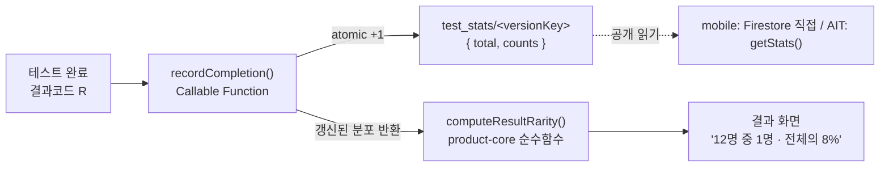

# 결과 통계 ("N명 중 1명")

결과 화면에서 "나는 N명 중 1명"이라는 희소성을 보여주는 기능입니다. 완료 수를 결과 code별로 집계하고, 사용자가 받은 결과의 비율을 화면에 표시합니다.

## 흐름



핵심은 완료 시 `recordCompletion` 한 번 호출로 **기록 + 최신 분포 반환**을 동시에 받아, 본인을 포함한 수치를 바로 보여주는 것입니다.

## 데이터 모델

Firestore `test_stats/<versionKey>` (versionKey = `${testId}@${version}`)

```json
{
  "testId": "dpti",
  "version": 1,
  "total": 1000,
  "counts": { "ACLO": 80, "ACLF": 120, "...": 0 },
  "updatedAt": "<serverTimestamp>"
}
```

- 버전별로 문서를 분리해, 콘텐츠 `version`이 바뀌면 통계가 섞이지 않습니다.
- 쓰기는 `recordCompletion`만 가능합니다(`firebase/firestore.rules`에서 `test_stats` client write 금지).
- 읽기는 공개입니다. mobile은 Firestore SDK로 직접 읽고, Firestore SDK가 없는 AIT는 `getStats`를 호출합니다.

## 계산 로직 (product-core)

`packages/product-core/src/stats.js` — SDK 비의존 순수함수라 mobile/AIT가 공유합니다.

```js
import { computeResultRarity, formatRarityKo } from '@seorilabs/trait-test-core';

const distribution = await statsRepository.get(testId, version); // { total, counts }
const rarity = computeResultRarity(distribution, score.result.code);
// { resultCode, total, count, share, oneInN, enoughSample }

formatRarityKo(rarity); // "12명 중 1명 · 전체의 8%"  또는  "아직 집계 중이에요"
```

- `oneInN = round(total / count)` = "N명 중 1명"의 N
- `share = count / total`
- `enoughSample`: `total >= MIN_RARITY_SAMPLE`(기본 100)이고 `count > 0`일 때만 노출. 표본이 적을 때 "1명 중 1명" 같은 무의미한 수치를 막습니다.
- `total`은 저장값을 믿지 않고 `counts` 합에서 재계산해 드리프트를 막습니다.

## Cloud Functions

`firebase/functions/index.js` (region `asia-northeast3`, firebase-functions v7 / admin v13)

| 함수 | 용도 | 입력 | 반환 |
| --- | --- | --- | --- |
| `recordCompletion` | 완료 1건 기록 + 분포 반환 | `{ testId, version, resultCode }` | `{ total, counts }` |
| `getStats` | 분포만 조회 | `{ testId, version }` | `{ total, counts }` |

- `recordCompletion`은 `enforceAppCheck: true`로 정품 앱 요청만 받아 카운트 조작을 막습니다.
- 입력은 `testId`/`version`/`resultCode` 형식을 서버에서 검증합니다.

## 남은 작업 / 블로커

- **Firebase project ID 미확정** — `firebase/.firebaserc`가 `확정 필요` 상태라 아직 배포 불가. project 확정 후 `firebase deploy --only functions`.
- **App Check provider 등록** — mobile(DeviceCheck/Play Integrity), AIT 경로의 attestation 방식을 출시 전 확정. AIT에서 App Check가 어려우면 해당 target만 정책을 조정.
- **client 어댑터(`StatsRepository`) 미구현** — `apps/mobile`·`apps/ait`는 아직 셸. 결과 화면이 생기면 `recordCompletion` 호출 → `computeResultRarity` → 표시를 연결.
- **중복 집계 방지(후속)** — 한 사용자가 `recordCompletion`을 여러 번 부르면 중복 카운트됨. 클라이언트 완료 id 기반 dedupe는 후속 과제.
- **resultCode 카탈로그 검증(후속)** — 현재는 형식만 검증. 실제 테스트의 result 집합과 대조하는 검증은 후속.
