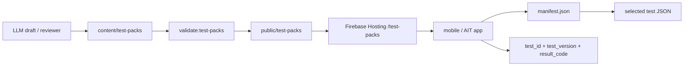

# 테스트팩 데이터 구조

성향 테스트 허브의 테스트 콘텐츠는 앱 코드가 아니라 정적 JSON으로 관리합니다.

## 경로

| 역할 | 경로 | 메모 |
| --- | --- | --- |
| source JSON | `content/test-packs/` | 사람이 수정하는 테스트팩 원본 |
| publish JSON | `public/test-packs/` | Firebase Hosting에 그대로 올릴 산출물 |
| manifest | `public/test-packs/manifest.json` | 앱이 가장 먼저 읽는 파일 |
| test payload | `public/test-packs/packs/<packId>/tests/<testId>.json` | 선택한 테스트만 lazy load |

앱 runtime은 `/test-packs/manifest.json`을 읽습니다. Firebase Hosting에서는 `public/test-packs` 내용을 `/test-packs` 아래로 배포하면 됩니다.

## Manifest

`manifest.json`은 수백 개 테스트를 담아도 빠르게 목록/필터를 만들 수 있도록 full question/result payload를 넣지 않습니다.

핵심 필드:

- `schemaVersion`: 현재 `1`
- `filters.categories`: UI 카테고리 필터 목록
- `filters.tags`: UI 태그 필터 목록
- `tests[].testId`: 영구 고유 ID
- `tests[].version`: 콘텐츠 버전
- `tests[].path`: full test JSON path
- `tests[].stats.aggregateKey`: 테스트 전체 통계 key
- `tests[].stats.versionKey`: 버전별 통계 key, 예: `dpti@1`

## Test ID 규칙

- `testId`는 kebab-case만 허용합니다. 예: `dpti`, `daily-rhythm-test`
- 한 번 공개한 `testId`는 의미가 바뀌면 안 됩니다.
- 문항/결과 텍스트가 바뀌면 `version`을 올립니다.
- 통계 저장은 최소 `test_id`, `test_version`, `result_code`를 분리해서 저장합니다.
- 유저별 진행/결과 key는 `testId@version` 기준으로 잡습니다.

## 새 테스트 추가 절차

1. `content/test-packs/packs/<packId>/tests/<testId>.json`을 추가합니다.
2. `content/test-packs/manifest.json`의 `tests`와 필요하면 `filters`에 metadata를 추가합니다.
3. `pnpm validate:test-packs -- --assetRoot=content/test-packs`로 source를 검증합니다.
4. `public/test-packs`에 반영합니다.
5. `pnpm validate:test-packs`로 publish 산출물을 검증합니다.

현재는 seed 생성 스크립트가 있습니다.

```bash
pnpm generate:test-packs
pnpm validate:test-packs
pnpm check:content
```

주의: `pnpm generate:test-packs`는 현재 seed용 `content/test-packs/manifest.json`, `content/test-packs/packs`, `public/test-packs`를 재생성합니다. draft 폴더는 보존하지만, 운영 단계의 generated 테스트 publish에는 사용하지 않습니다.

자동 생성 테스트는 `generate:test-packs`를 쓰지 않습니다. draft를 만든 뒤 append-safe publish 스크립트를 사용합니다.

```bash
pnpm publish:test-pack-draft -- --draft=content/test-packs/drafts/<testId>.json
pnpm check:content
```

자세한 자동 생성/PR 체계는 [docs/content-automation.md](content-automation.md)를 봅니다.

## Firebase Hosting 운영 방향



Firestore는 앱이 읽는 full content 저장소가 아니라 통계, publish state, draft/review queue 같은 2차 서비스에 우선 사용합니다.
