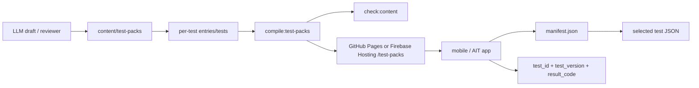

# 테스트팩 데이터 구조

성향 테스트 허브의 테스트 콘텐츠는 앱 코드가 아니라 정적 JSON으로 관리합니다.

## 경로

| 역할 | 경로 | 메모 |
| --- | --- | --- |
| source JSON | `content/test-packs/` | 사람이 수정하는 테스트팩 원본 |
| publish JSON | `public/test-packs/` | GitHub Pages 또는 Firebase Hosting에 그대로 올릴 산출물 |
| manifest | `public/test-packs/manifest.json` | 앱이 가장 먼저 읽는 파일 |
| test payload | `public/test-packs/packs/<packId>/tests/<testId>.json` | 선택한 테스트만 lazy load |
| generated entry | `content/test-packs/packs/generated-v1/entries/<testId>.json` | 자동 생성 테스트의 manifest metadata 원본 |

앱 runtime은 `/test-packs/manifest.json`을 읽습니다. GitHub Pages와 Firebase Hosting 모두 `public/test-packs` 내용을 `/test-packs` 아래로 배포하면 됩니다.

repo에서 사람이 관리하는 원본은 `content/test-packs`입니다. 자동 생성 테스트는 shared manifest를 직접 수정하지 않고, 테스트별 `entries/<testId>.json`, `tests/<testId>.json`만 추가합니다. `public/test-packs`와 pack index는 build/check 단계에서 컴파일됩니다.

## Manifest

`manifest.json`은 수백 개 테스트를 담아도 빠르게 목록/필터를 만들 수 있도록 full question/result payload를 넣지 않습니다.

핵심 필드:

- `schemaVersion`: 현재 `1`
- `filters.categories`: UI 카테고리 필터 목록
- `filters.tags`: UI 태그 필터 목록
- `tests[].testId`: 영구 고유 ID
- `tests[].version`: 콘텐츠 버전
- `tests[].path`: full test JSON path
- `tests[].stats.aggregateKey`: 테스트 전체 통계 key
- `tests[].stats.versionKey`: 버전별 통계 key, 예: `dpti@1`

## Test ID 규칙

- `testId`는 kebab-case만 허용합니다. 예: `dpti`, `daily-rhythm-test`
- 한 번 공개한 `testId`는 의미가 바뀌면 안 됩니다.
- 문항/결과 텍스트가 바뀌면 `version`을 올립니다.
- 통계 저장은 최소 `test_id`, `test_version`, `result_code`를 분리해서 저장합니다.
- 유저별 진행/결과 key는 `testId@version` 기준으로 잡습니다.

## 새 테스트 추가 절차

1. `content/test-packs/drafts/<testId>.json` draft를 만듭니다.
2. `pnpm publish:test-pack-draft -- --draft=content/test-packs/drafts/<testId>.json`를 실행합니다.
3. publish 결과로 생긴 테스트별 파일만 PR에 포함합니다.
4. `pnpm check:content`로 컴파일된 임시 산출물을 검증합니다.
5. `pnpm check`로 전체 gate를 확인합니다.

자동 생성 테스트 PR에는 아래 공유 산출물을 포함하지 않습니다.

- `content/test-packs/manifest.json`
- `content/test-packs/packs/<packId>/pack.json`
- `public/test-packs/**`

현재는 seed 생성 스크립트가 있습니다.

```bash
pnpm generate:test-packs
pnpm compile:test-packs
pnpm sync:test-packs
pnpm validate:test-packs
pnpm check:content
```

주의: `pnpm generate:test-packs`는 seed pack과 base manifest를 재생성합니다. generated 테스트의 tests/entries는 보존하지만, 운영 단계의 generated 테스트 publish에는 사용하지 않습니다.

자동 생성 테스트는 `generate:test-packs`를 쓰지 않습니다. draft를 만든 뒤 conflict-free publish 스크립트를 사용합니다.

```bash
pnpm publish:test-pack-draft -- --draft=content/test-packs/drafts/<testId>.json
pnpm check:content
```

자세한 자동 생성/PR 체계는 [docs/content-automation.md](content-automation.md)를 봅니다.

자동 생성 테스트는 기존 seed보다 높은 품질 gate를 적용합니다.

- 최소 8문항 (표준 8문항, 완주율 지표로 검증)
- 최소 4개 결과
- 문항별 최소 3개 선택지
- 결과별 상세 설명, 강점 3개 이상, 주의점 2개 이상, 적용 조언, 공유 문구
- `imagePath`, `shareImagePath` 또는 테스트팩 이미지 파일 없음

## 정적 호스팅 운영 방향



Firestore는 앱이 읽는 full content 저장소가 아니라 통계, publish state, draft/review queue 같은 2차 서비스에 우선 사용합니다.
